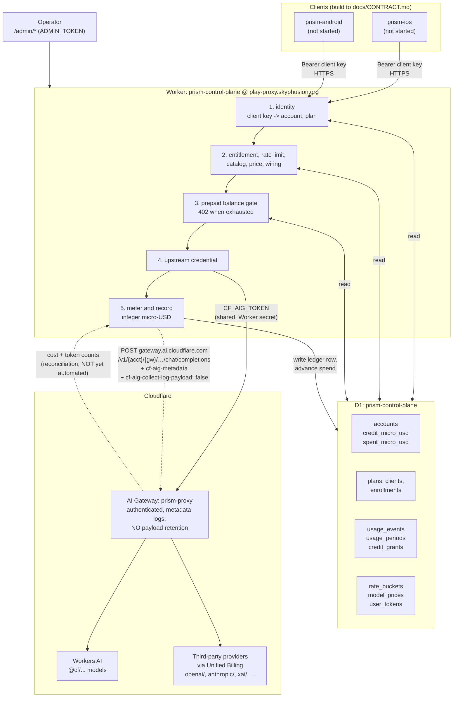

# Architecture

How prism-control-plane is put together, what it is wired to in production, and which parts of the
commercial model are in the tree versus still on paper.

`docs/CONTRACT.md` (normative prose) and `docs/openapi.yaml` (machine-readable) are the **client
build target**; `prism-ios` and `prism-android` implement those, not this file. This file is for
operators and for anyone changing the plane itself.

## What it is

One Cloudflare Worker that stands between a mobile client and a model, and answers exactly two
questions before spending anything: **who is this, and may they afford it.** It owns accounts, plan
entitlements, rate limits, a prepaid balance, and a priced usage ledger.

It deliberately does **not** own inference breadth or the multimodal surface. Those stay in
[prism](https://github.com/skyphusion-labs/prism) at `play.skyphusion.org`. This plane is the metered
door only.

## Live deployment

| Thing | Value |
| --- | --- |
| Worker | `prism-control-plane` |
| Hostname | `play-proxy.skyphusion.org` (custom domain, so the DNS record and route are wrangler-owned) |
| `workers.dev` | **off.** A second un-DNS'd door to the same metered routes is a hole, not a convenience |
| AI Gateway | `prism-proxy` (authenticated, `collect_logs=true`, `cache_ttl=0`) |
| D1 | `prism-control-plane` |
| KV / R2 / Queues / Durable Objects | **none.** Not used and not planned; the only binding is `DB` |
| Cloudflare account | `fabcb25d9c7eb087110ec474a03e50d2` (prod, `@skyphusion.org`) |
| Credential mode | `shared` (see below) |

`cache_ttl` is 0 on purpose. A gateway cache hit costs nothing upstream, so a cached answer would be
served for free while the ledger charged for it, or charged for while nothing was spent. Either way
the meter would be lying. Caching can come back when the ledger knows how to read
`cf-aig-cache-status`.

## The flow

The dashed gateway-to-meter edge is the honest part: Cloudflare's own per-request cost figure is
available in the gateway logs, and nothing reads it back yet. See **Pricing** below.

### Gate order

`src/routes/chat.ts` documents this in full and the order is load-bearing, cheapest and most certain
first. Nothing that costs money happens before step 11.

1. body size, 2. body shape, 3. identity, 4. plan, 5. rate limit, 6. model and tier, 7. price,
8. wiring, 9. balance, 10. credential, 11. spend, 12. meter.

For a buffered response step 12 is awaited: the plane does not hand back a completion it has not
tried to record. A stream cannot work that way, because token counts arrive after the headers, so
`src/stream.ts` relays the bytes untouched and scans for the trailing usage frame, recording through
`waitUntil`. A stream that never sends one is recorded **unmetered**, which is a first-class ledger
outcome and not a zero charge.

## Identity and the shared credential

Two completely separate credentials, and conflating them is the failure this section exists to
prevent.

**Client keys** (`src/auth.ts`) identify a Prism user to *this plane*. They are minted here, stored
hashed, and are never Cloudflare credentials. A client key cannot authenticate anything at
Cloudflare.

**The upstream credential** is what reaches a model. `UPSTREAM_CREDENTIAL_MODE` selects it:

- **`shared` (the default, and the product path).** One account-scoped Cloudflare API token,
  `CF_AIG_TOKEN`, holding AI Gateway Run plus Workers AI Read and nothing else. Sent as both
  `authorization` and `cf-aig-authorization` so the plane works whether gateway auth is on or off.
- **`per-user`.** Mints one Cloudflare API token per account, encrypted at rest in `user_tokens`.
  Supported, bounded by `USER_TOKEN_BUDGET`, and **off**.

Shared is the default because of a hard Cloudflare ceiling: **500 API tokens per account, total,
across every service on it**
([limits](https://developers.cloudflare.com/fundamentals/api/reference/limits/)). One token per Prism
user caps the product in the low hundreds and competes with vivijure's per-tenant provisioning for
the same slots. Per-user tokens buy Cloudflare-layer per-user revocation, which is worth having for a
deployment small enough to afford the slots, and worth nothing to a mobile product that cannot fit.

### Attribution without per-user tokens

Because the credential is shared, Cloudflare cannot tell whose request it was. `cf-aig-metadata`
carries that, and the ledger is the authority. **Exactly five entries, which is Cloudflare's cap**
(the first five are kept and the rest are silently dropped, so a sixth field would delete whichever
sorted last, not fail):

`account_id`, `client_id`, `plan_id`, `request_id`, `cf_token_id`.

### Privacy

No prompt or completion text is ever persisted, here or at Cloudflare.
`cf-aig-collect-log-payload: false` is hard-wired in `src/upstream.ts` with **no env override**,
because an invariant that can be switched off in config is a default.
`tests/schema-privacy.test.ts` fails the build if a column that could hold message text is added to
`migrations/`, and it carries a positive control so the scanner cannot silently stop working.

`AI_GATEWAY_COLLECT_LOG` is a different switch and defaults on: it keeps the **metadata** row (token
counts, model, provider, status, cost, duration). Keeping it is what makes Cloudflare's own cost
figure available to check our arithmetic against the biller's.

## Money

All money is **integer micro-USD** (1 USD = 1,000,000). No floats in the money path, and the unit is
in the name of every field carrying it.

### Intended commercial model

Conrad's model: a **flat plan carrying included tokens per month**, and once that allowance is used
up, usage burns **prepaid credits** at the going token rate. **No postpaid invoices and no overage
billing, ever.** When the money runs out the plane refuses with `402`.

### What is actually in the tree

**The prepaid half only.** This is a real gap, not a wording quibble:

| Piece | State |
| --- | --- |
| Prepaid balance (`accounts.credit_micro_usd`, `spent_micro_usd`) | **built** |
| Top-ups as an audited grant ledger (`credit_grants`, idempotent) | **built** |
| Pre-flight balance gate, `402` on exhaustion, never postpaid | **built** |
| One-time signup grant (`plans.signup_credit_micro_usd`) | **built** |
| **Monthly included token allowance** | **NOT built** |

`src/plans.ts` is explicit that the signup grant is not recurring: "a monthly reset would be a grant
of money nobody decided to give." That was the right call for a pure prepaid balance, and it means
the flat-plan monthly allowance has no implementation. `usage_periods` and `period_key` exist and
**count** usage per UTC calendar month; they do not grant anything.

So a plan today is an entitlement set (rate limit, output-token clamp, allowed tiers) plus an opening
credit, not a monthly bucket. Closing that gap needs a plan-level monthly allowance that is spent
before credits are, and it must not silently become a monthly cash grant. Tracked in
[#11](https://github.com/skyphusion-labs/prism-control-plane/issues/11); do not describe the allowance
as shipped until it is.

### Unmetered is not free

`src/meter.ts` treats "we could not price this" as an outcome distinct from "this cost zero". Do not
collapse them. A timeout is recorded as an unmetered row rather than as nothing, because the upstream
may have generated and billed tokens before the abort landed, and writing the gap down is the only
way it is ever visible.

## Pricing, and why it needs reconciliation

Findings live in **[issue #10](https://github.com/skyphusion-labs/prism-control-plane/issues/10)**.
Short version, all measured rather than assumed:

- AI Gateway Unified Billing passes provider list pricing through with **no markup**. The fee is
  **5% on loading credits**, not the ~10% first assumed.
- The authoritative rate table is the gateway's own
  `GET /v1/{account}/{gateway}/compat/models`, which returns `cost_in` / `cost_out` per token for
  every model including third parties. Treat it as the **source of truth**; Cloudflare's public
  Workers AI pricing page covers only `@cf/` models.
- **Rates move intraday.** Two models were repriced by Cloudflare inside an 8 hour window during this
  research (one by 2.5x, one by 10x, both downward). A static rate table in `src/catalog.ts` is
  therefore always potentially stale.
- **`tokens_out` under-reports on reasoning models.** `xai/grok-4.5` bills at vendor list but its
  logged output tokens omit billed reasoning tokens, so a locally computed cost from token counts can
  be low.

Those last two together are the argument for a **reconciliation job**: read the authoritative `cost`
from the AI Gateway logs, attribute it with `cf-aig-metadata`, and true up the D1 ledger, rather than
trusting a local computation against a table that can be stale. That job is now in the tree
([#12](https://github.com/skyphusion-labs/prism-control-plane/issues/12)); see the next section. The
ledger remains the plane's best **estimate** and the gateway remains the biller's truth; reconciliation
is what makes the difference between them visible instead of permanent. `/health/deep` reports how many
chat models still have no rate; an unpriced model is refused individually (`model_unpriced`) rather than
failing readiness, because unpriced is the expected state for much of the catalog.

Refreshing `src/catalog.ts` from `compat/models` is deliberately **not** part of #12. It attacks the same
staleness from the other end and deserves its own decision about runtime reads versus a committed table.

## Reconciliation: truing the ledger up against the biller

`POST /admin/reconcile`, operator-triggered. **There is no cron**, and that is a decision rather than an
omission: this is a robot with write access to a money column, driven by another system's telemetry, so
the first live runs happen with a human reading the report. A `scheduled` handler can call
`runReconcile` later; nothing in the run path assumes a request.

**Dry run is the default and it is absent-means-true.** Only a literal `"dry_run": false` writes money. A
dry run does every read, join and decision and reports exactly what it would move, while writing
nothing at all -- including the watermark, because a dry run that advanced the watermark would be a live
run that forgot to pay.

| File | Role |
| --- | --- |
| `src/aig-logs.ts` | The only place the gateway LOG API is read. GET only, and `guardLogPath` refuses the two stored-payload endpoints by throwing. |
| `src/reconcile.ts` | The decision for one row. Pure: no clock, no I/O. |
| `src/reconcile-run.ts` | The run: paging, applying, the watermark, the reverse check, the structured logs. |
| `src/routes/reconcile.ts` | The operator door and its input validation. |
| `migrations/0003_reconcile_gateway_cost.sql` | `usage_adjustments`, `reconcile_state`, and two period counters. |

### Seven outcomes, five of which move nothing

`adjust` (spend or credit), `in_agreement`, and five refusals: `no_request_id` (not our traffic),
`cached` (the gateway runs `cache_ttl=0`, so a cached row means the cache was enabled without teaching
the ledger to read `cf-aig-cache-status`; its cost of 0 would otherwise refund the whole estimate),
`unknown_cost` (**absent is unknown, never zero** -- reading it as free turns a gap in Cloudflare's
telemetry into a credit refund), `no_ledger_row` (spend we were billed and never recorded: the one skip
that should page someone), and `account_mismatch`. Every outcome has its own counter, so the alarming one
cannot hide inside a total.

### Up is spend, down is a credit grant

Both money columns on `accounts` are monotonic by construction (migration 0002) so each can be re-summed
against its own audit trail. A downward correction is therefore a **`credit_grants` row**, not a
decrement of `spent_micro_usd`: it reaches the same balance and keeps both trails re-summable. The
original `usage_events` row is **never rewritten** -- the drift is the finding, and overwriting it
destroys the only evidence the meter and the biller ever disagreed. Adjustments land in the period the
**request** belongs to, not the period the run happened in.

`idempotency_key` is `aig:<gateway log id>` and is UNIQUE. That is what makes the job safe to re-run:
rows arrive late, page boundaries get crossed twice, runs die halfway, and every retry must be a no-op.

### The watermark is deliberately behind the present

The feed is filtered on `created_at`, so a row that appears with a timestamp already behind the watermark
is invisible forever. The advance is clamped to `now - 15min` (`SETTLE_MS`) and never moves backwards, so
the trailing edge is re-read every run and the idempotency key makes that free. A run is capped at 2000
rows so a backlog makes progress and reports `truncated` instead of dying and redoing the same prefix.

### Cost is a decimal USD float on the wire, and stops being one immediately

Cloudflare reports e.g. `2.8220000000000003e-06` and `0.000019416000000000002` (both observed live).
`microUsdFromUsd` converts through the decimal digits with `BigInt` and **rounds up**, matching
`src/meter.ts`: `Math.round(cost * 1e6)` and `toFixed(6)` both lose fractions of a micro-USD in the
direction a cost-recovery product cannot afford.

### Both directions are checked

The forward check reads gateway rows and joins to the ledger. The **reverse check** lists ledger rows in
the same window and reports any whose `request_id` no gateway row carried: a request this plane metered
that the gateway never recorded. It is approximate at the window edges (a ledger row is written after the
response, so its timestamp is later than the gateway's) and it moves no money, so it runs on a dry run
too. Treat a persistent count as the finding.

### Observability

Every run emits `reconcile.run` at info level (rows, drift, each skip counter, watermark) as the time
series, and `reconcile.alert` at **error** level only when something needs a human: unrecorded spend, an
account mismatch, an unmatched ledger row, or drift past `DRIFT_ALERT_RATIO` (5% of the biller's total,
counting both directions so an over-charge cannot cancel an under-charge). An alert rule can be "this
event exists" rather than a threshold somebody has to re-tune. Nothing in either payload carries prompt
text, completion text, or a bearer.

### Credential

The runtime `CF_AIG_TOKEN` was **widened** with `AI Gateway Read` rather than joined by a second token
(2026-08-05, verified live against `prism-proxy`). A separate read token would be another secret to
escrow, rotate and lose, buying no isolation that matters: the token can already spend on this gateway.
Editing a Cloudflare token's policies does **not** change its value, so the escrowed ciphertext and the
live Worker secret stayed valid. In per-user credential mode there is no shared token, so
`POST /admin/reconcile` answers 503 rather than quietly doing nothing.

### Why the spend path addresses the gateway host, not the AI REST API

Resolves [#15](https://github.com/skyphusion-labs/prism-control-plane/issues/15). This section records
the measurement rather than the first diagnosis, because the first diagnosis was partly wrong and the
correction is the interesting part.

Eleven live probes on 2026-08-05, all `@cf/meta/llama-3.2-1b-instruct` at 8 output tokens, each tagged
with a distinct `cf-aig-metadata.request_id` and then looked up in the gateway's own log feed:

| Probe | Status | `cf-aig-log-id` returned | Log row |
| --- | --- | --- | --- |
| REST `POST /ai/v1/chat/completions` + `cf-aig-gateway-id: prism-proxy` | `200` | no `cf-aig-*` headers at all | **yes, on `prism-proxy`**, full metadata, `cost` |
| Same, `cf-aig-gateway-id: default` | `200` | none | yes, on `default` |
| Same, `prism-proxy`, invalid `cf-aig-authorization`, **valid `Authorization`** | `200` | none | yes. Wrong slot; proves nothing, see below |
| Same, headers byte-identical to the shipped `upstreamHeaders` | `200` | none | yes, on `prism-proxy` |
| `.../prism-proxy/workers-ai/v1/chat/completions` | `200` | `01KZ8ER0NY...` | yes |
| Same, invalid `cf-aig-authorization` | **`401`** `AiGatewayError` 2009 | -- | no |
| Same, **keyless** (`cf-aig-authorization` only, no `authorization`) | `200` | `01KZ8EW3FE...` | yes |
| Same, `stream: true` | `200` | `01KZ8EW4YM...` | yes, and the trailing usage frame arrived |
| `.../prism-proxy/compat/chat/completions`, `workers-ai/@cf/...` | `200` | `01KZ8ER13P...` | yes |
| Same, invalid `cf-aig-authorization` | **`401`** | -- | no |
| Same, `anthropic/claude-haiku-4-5`, keyless | `200` | `01KZ8EXF6T...` | yes, `provider=anthropic`, `cost` |

`prism-proxy`: `collect_logs: true`, `cache_ttl: 0`, `authentication: true`.

**The REST path does route and does log**, contrary to the original #15 report. Nine of the eleven probes
above are about a narrower defect than the one first reported, and the row that looked like an auth
bypass was a probe error. Both corrections are below.

#### What the move to the gateway host actually buys

In descending order of how much it is worth:

1. **A per-request transit receipt.** `cf-aig-log-id` comes back on every served response from the
   gateway host, streamed or not. The REST path returns **no `cf-aig-*` response headers at all**, so
   there transit could only be inferred. A plane that has quietly stopped going through its gateway
   otherwise looks exactly like one that has not, and `src/upstream.ts` now logs at **error** level when
   a served request carries no log id.
2. **`usage_events.gateway_log_id` becomes populatable.** This is a **debugging join, not a
   reconciliation prerequisite**, and conflating the two is how #15 was first misread. `src/reconcile.ts`
   joins a gateway row to a ledger row on `cf-aig-metadata.request_id`, and the REST path emitted those
   rows with metadata and `cost` intact. Reconciliation worked before this change and works after it.
   What the log id adds is a direct row-level handle when one request needs chasing.
3. **The credential can narrow.** The gateway host needs `AI Gateway Run`. The REST endpoint also wanted
   `Workers AI Read`. One fewer permission on a token that can spend.
4. **On `/compat`, the plain `authorization` header is the provider key slot**, so keeping the Cloudflare
   token out of it is a constraint *of* this path rather than a flaw of the old one. See below.

#### What this change is not: a security fix

The REST path was authenticated. Cloudflare's
[Authenticated Gateway doc](https://developers.cloudflare.com/ai-gateway/configuration/authentication/)
is explicit that the credential slot differs by surface: the REST API on `api.cloudflare.com` reads the
standard `Authorization` header, and only the provider-native endpoints on `gateway.ai.cloudflare.com`
read `cf-aig-authorization`. The old `src/upstream.ts` sent a valid token in `Authorization` as well, so
`prism-proxy` was authenticating that traffic the whole time.

The probe row above marked *invalid `cf-aig-authorization`, valid `Authorization`* therefore proves
nothing about the gate. It varied `cf-aig-authorization` while leaving a valid `Authorization` in place,
which on that surface is the wrong slot: `200` is the **documented** outcome of a correctly authenticated
request. The control probe that was missing from the original set has since been run, and it closes the
question:

| Control probe | Status | Body |
| --- | --- | --- |
| REST + `cf-aig-gateway-id: prism-proxy`, **no `Authorization`** | **`401`** | `code 10000`, `Authentication error` |
| REST + `cf-aig-gateway-id: prism-proxy`, **invalid `Authorization`** | **`401`** | `code 10000`, `Authentication error` |
| `.../prism-proxy/workers-ai/v1/chat/completions`, **no `cf-aig-authorization`** | **`401`** | `AiGatewayError` `2009`, `Unauthorized` |

Run 2026-08-05, **$0.00**: no credential means no completion, so all three refuse before any inference.
The REST surface validates the credential in `Authorization` and is not anonymously reachable, and the
third row independently re-confirms `prism-proxy` still runs `authentication: true`. So gateway auth was
enforced on the old path all along, in a header the code was already sending. **Do not re-file #15 as a
security issue.**

#### The trade

Cloudflare **recommends the REST API for new integrations** and describes the `gateway.ai.cloudflare.com`
endpoints as continuing to work. This plane deliberately sits on the softer-deprecated surface, and it
does so to buy the receipt in (1). That is also where every sibling on this estate already is:
common-thread, prism's third-party dispatch, and the vivijure tenant modules all address the gateway host
with `cf-aig-authorization`. Revisit if Cloudflare either starts returning `cf-aig-*` receipts on the
REST path or announces a sunset here.

Two endpoints, selected from the catalog's `billing` field:

| Billing surface | Endpoint | Model id sent |
| --- | --- | --- |
| `workers-ai` | `/workers-ai/v1/chat/completions` | `@cf/...` unchanged |
| `unified-billing` | `/compat/chat/completions` | `provider/model` unchanged |

**The credential goes in `cf-aig-authorization` and nowhere else.** On `/compat` the plain
`authorization` header is the provider key slot: a value there is forwarded upstream as BYOK, which
would both disclose a Cloudflare API token to Anthropic or OpenAI and switch the request off Unified
Billing. Keyless is measurably sufficient on both endpoints, and it matches prism's own provider
dispatch since v0.93.0.

`tests/upstream.test.ts` pins the host, the per-surface endpoint, the absence of an `authorization`
header, and a loud `console.error` when the gateway serves a request it did not log. A missing log id is
**not** turned into a client error: the completion is already generated and already billed to us, so
refusing it would throw money away and deny the caller a response we paid for.

## Code map

| File | Role |
| --- | --- |
| `src/index.ts` | Worker entry plus the whole route table. `handleRequest` takes its dependencies, which is what makes tests hermetic. |
| `src/env.ts` | Hand-authored `Env`, mirroring `wrangler.example.toml`. Never commit a generated `worker-configuration.d.ts`. |
| `src/upstream.ts` | The one place a model is called, always at the AI Gateway host, and the only place the privacy headers are set. |
| `src/aig-logs.ts` | The one place the gateway LOG API is read. GET only; refuses stored-payload endpoints. |
| `src/reconcile.ts` | What one gateway row means for one ledger row. Pure. |
| `src/reconcile-run.ts` | One reconciliation run: paging, applying, watermark, reverse check. |
| `src/token-minter.ts` | `UpstreamCredentialSource`: `SharedTokenSource` and the opt-in `CfUserTokenProvider`. |
| `src/balance.ts` | The pre-flight prepaid decision. Pure. |
| `src/meter.ts` | Pricing one request, or declining to. Pure. |
| `src/catalog.ts` | Model allowlist and rate table, one table on purpose. |
| `src/plans.ts` | Plan validation, tier entitlement, output-token clamping. Pure. |
| `src/stream.ts` | Byte-for-byte SSE relay plus trailing-usage capture. |
| `src/store.ts` / `src/store-d1.ts` | Persistence interface and its only D1 implementation. |
| `src/routes/*.ts` | Handlers. `chat.ts` is the metered door and documents its gate order. |

Pure decision modules plus two injected seams (`ControlPlaneStore`, `InferenceRunner`) mean the whole
request path runs in plain Node vitest: no workerd, no Miniflare, no network. Keep it that way. A new
behaviour that needs a binding goes behind an interface, not into a handler.

## Operating it

Deploy, secret, and escrow procedure is in **`CLAUDE.md`**. In brief: the live config is a repo
secret with its canonical copy escrowed in `crew-secrets`, Worker secrets are set once with
`wrangler secret put` and persist across deploys, and prod ships from a tag that is already on
`main`.
