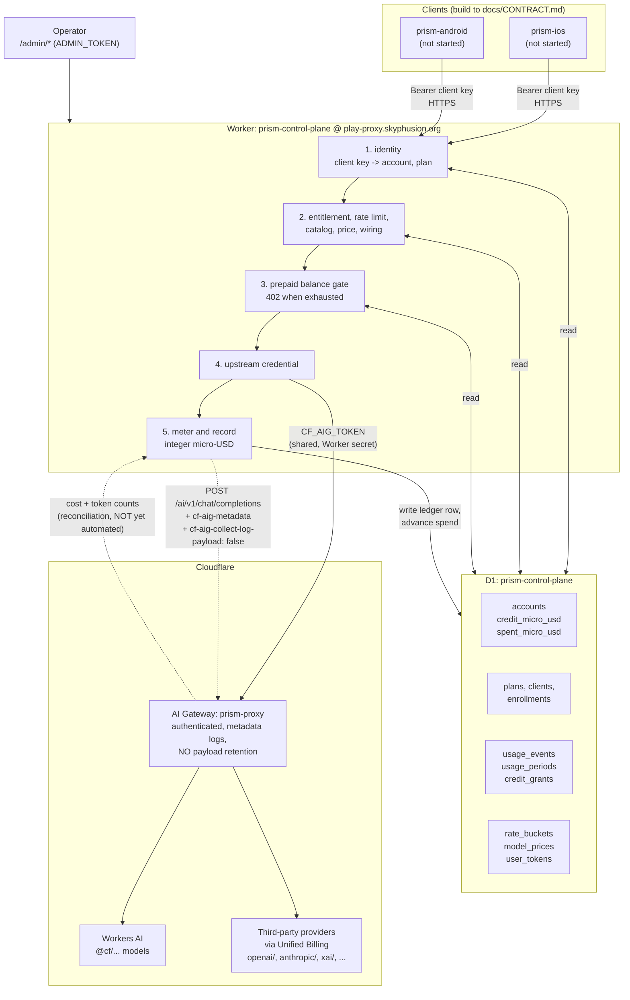

# Architecture

How prism-control-plane is put together, what it is wired to in production, and which parts of the
commercial model are in the tree versus still on paper.

`docs/CONTRACT.md` (normative prose) and `docs/openapi.yaml` (machine-readable) are the **client
build target**; `prism-ios` and `prism-android` implement those, not this file. This file is for
operators and for anyone changing the plane itself.

## What it is

One Cloudflare Worker that stands between a mobile client and a model, and answers exactly two
questions before spending anything: **who is this, and may they afford it.** It owns accounts, plan
entitlements, rate limits, a prepaid balance, and a priced usage ledger.

It deliberately does **not** own inference breadth or the multimodal surface. Those stay in
[prism](https://github.com/skyphusion-labs/prism) at `play.skyphusion.org`. This plane is the metered
door only.

## Live deployment

| Thing | Value |
| --- | --- |
| Worker | `prism-control-plane` |
| Hostname | `play-proxy.skyphusion.org` (custom domain, so the DNS record and route are wrangler-owned) |
| `workers.dev` | **off.** A second un-DNS'd door to the same metered routes is a hole, not a convenience |
| AI Gateway | `prism-proxy` (authenticated, `collect_logs=true`, `cache_ttl=0`) |
| D1 | `prism-control-plane` |
| KV / R2 / Queues / Durable Objects | **none.** Not used and not planned; the only binding is `DB` |
| Cloudflare account | `fabcb25d9c7eb087110ec474a03e50d2` (prod, `@skyphusion.org`) |
| Credential mode | `shared` (see below) |

`cache_ttl` is 0 on purpose. A gateway cache hit costs nothing upstream, so a cached answer would be
served for free while the ledger charged for it, or charged for while nothing was spent. Either way
the meter would be lying. Caching can come back when the ledger knows how to read
`cf-aig-cache-status`.

## The flow

The dashed gateway-to-meter edge is the honest part: Cloudflare's own per-request cost figure is
available in the gateway logs, and nothing reads it back yet. See **Pricing** below.

### Gate order

`src/routes/chat.ts` documents this in full and the order is load-bearing, cheapest and most certain
first. Nothing that costs money happens before step 11.

1. body size, 2. body shape, 3. identity, 4. plan, 5. rate limit, 6. model and tier, 7. price,
8. wiring, 9. balance, 10. credential, 11. spend, 12. meter.

For a buffered response step 12 is awaited: the plane does not hand back a completion it has not
tried to record. A stream cannot work that way, because token counts arrive after the headers, so
`src/stream.ts` relays the bytes untouched and scans for the trailing usage frame, recording through
`waitUntil`. A stream that never sends one is recorded **unmetered**, which is a first-class ledger
outcome and not a zero charge.

## Identity and the shared credential

Two completely separate credentials, and conflating them is the failure this section exists to
prevent.

**Client keys** (`src/auth.ts`) identify a Prism user to *this plane*. They are minted here, stored
hashed, and are never Cloudflare credentials. A client key cannot authenticate anything at
Cloudflare.

**The upstream credential** is what reaches a model. `UPSTREAM_CREDENTIAL_MODE` selects it:

- **`shared` (the default, and the product path).** One account-scoped Cloudflare API token,
  `CF_AIG_TOKEN`, holding AI Gateway Run plus Workers AI Read and nothing else. Sent as both
  `authorization` and `cf-aig-authorization` so the plane works whether gateway auth is on or off.
- **`per-user`.** Mints one Cloudflare API token per account, encrypted at rest in `user_tokens`.
  Supported, bounded by `USER_TOKEN_BUDGET`, and **off**.

Shared is the default because of a hard Cloudflare ceiling: **500 API tokens per account, total,
across every service on it**
([limits](https://developers.cloudflare.com/fundamentals/api/reference/limits/)). One token per Prism
user caps the product in the low hundreds and competes with vivijure's per-tenant provisioning for
the same slots. Per-user tokens buy Cloudflare-layer per-user revocation, which is worth having for a
deployment small enough to afford the slots, and worth nothing to a mobile product that cannot fit.

### Attribution without per-user tokens

Because the credential is shared, Cloudflare cannot tell whose request it was. `cf-aig-metadata`
carries that, and the ledger is the authority. **Exactly five entries, which is Cloudflare's cap**
(the first five are kept and the rest are silently dropped, so a sixth field would delete whichever
sorted last, not fail):

`account_id`, `client_id`, `plan_id`, `request_id`, `cf_token_id`.

### Privacy

No prompt or completion text is ever persisted, here or at Cloudflare.
`cf-aig-collect-log-payload: false` is hard-wired in `src/upstream.ts` with **no env override**,
because an invariant that can be switched off in config is a default.
`tests/schema-privacy.test.ts` fails the build if a column that could hold message text is added to
`migrations/`, and it carries a positive control so the scanner cannot silently stop working.

`AI_GATEWAY_COLLECT_LOG` is a different switch and defaults on: it keeps the **metadata** row (token
counts, model, provider, status, cost, duration). Keeping it is what makes Cloudflare's own cost
figure available to check our arithmetic against the biller's.

## Money

All money is **integer micro-USD** (1 USD = 1,000,000). No floats in the money path, and the unit is
in the name of every field carrying it.

### Intended commercial model

Conrad's model: a **flat plan carrying included tokens per month**, and once that allowance is used
up, usage burns **prepaid credits** at the going token rate. **No postpaid invoices and no overage
billing, ever.** When the money runs out the plane refuses with `402`.

### What is actually in the tree

**The prepaid half only.** This is a real gap, not a wording quibble:

| Piece | State |
| --- | --- |
| Prepaid balance (`accounts.credit_micro_usd`, `spent_micro_usd`) | **built** |
| Top-ups as an audited grant ledger (`credit_grants`, idempotent) | **built** |
| Pre-flight balance gate, `402` on exhaustion, never postpaid | **built** |
| One-time signup grant (`plans.signup_credit_micro_usd`) | **built** |
| **Monthly included token allowance** | **NOT built** |

`src/plans.ts` is explicit that the signup grant is not recurring: "a monthly reset would be a grant
of money nobody decided to give." That was the right call for a pure prepaid balance, and it means
the flat-plan monthly allowance has no implementation. `usage_periods` and `period_key` exist and
**count** usage per UTC calendar month; they do not grant anything.

So a plan today is an entitlement set (rate limit, output-token clamp, allowed tiers) plus an opening
credit, not a monthly bucket. Closing that gap needs a plan-level monthly allowance that is spent
before credits are, and it must not silently become a monthly cash grant. Tracked in
[#11](https://github.com/skyphusion-labs/prism-control-plane/issues/11); do not describe the allowance
as shipped until it is.

### Unmetered is not free

`src/meter.ts` treats "we could not price this" as an outcome distinct from "this cost zero". Do not
collapse them. A timeout is recorded as an unmetered row rather than as nothing, because the upstream
may have generated and billed tokens before the abort landed, and writing the gap down is the only
way it is ever visible.

## Pricing, and why it needs reconciliation

Findings live in **[issue #10](https://github.com/skyphusion-labs/prism-control-plane/issues/10)**.
Short version, all measured rather than assumed:

- AI Gateway Unified Billing passes provider list pricing through with **no markup**. The fee is
  **5% on loading credits**, not the ~10% first assumed.
- The authoritative rate table is the gateway's own
  `GET /v1/{account}/{gateway}/compat/models`, which returns `cost_in` / `cost_out` per token for
  every model including third parties. Treat it as the **source of truth**; Cloudflare's public
  Workers AI pricing page covers only `@cf/` models.
- **Rates move intraday.** Two models were repriced by Cloudflare inside an 8 hour window during this
  research (one by 2.5x, one by 10x, both downward). A static rate table in `src/catalog.ts` is
  therefore always potentially stale.
- **`tokens_out` under-reports on reasoning models.** `xai/grok-4.5` bills at vendor list but its
  logged output tokens omit billed reasoning tokens, so a locally computed cost from token counts can
  be low.

Those last two together are the argument for a **reconciliation job**: read the authoritative `cost`
from the AI Gateway logs, attribute it with `cf-aig-metadata`, and true up the D1 ledger, rather than
trusting a local computation against a table that can be stale. That job does not exist yet
([#12](https://github.com/skyphusion-labs/prism-control-plane/issues/12)). Until it does, the ledger is
the plane's best estimate and the gateway is the biller's truth. `/health/deep`
reports how many chat models still have no rate; an unpriced model is refused individually
(`model_unpriced`) rather than failing readiness, because unpriced is the expected state for much of
the catalog.

## Code map

| File | Role |
| --- | --- |
| `src/index.ts` | Worker entry plus the whole route table. `handleRequest` takes its dependencies, which is what makes tests hermetic. |
| `src/env.ts` | Hand-authored `Env`, mirroring `wrangler.example.toml`. Never commit a generated `worker-configuration.d.ts`. |
| `src/upstream.ts` | The one place Cloudflare's AI REST API is called, and the only place the privacy headers are set. |
| `src/token-minter.ts` | `UpstreamCredentialSource`: `SharedTokenSource` and the opt-in `CfUserTokenProvider`. |
| `src/balance.ts` | The pre-flight prepaid decision. Pure. |
| `src/meter.ts` | Pricing one request, or declining to. Pure. |
| `src/catalog.ts` | Model allowlist and rate table, one table on purpose. |
| `src/plans.ts` | Plan validation, tier entitlement, output-token clamping. Pure. |
| `src/stream.ts` | Byte-for-byte SSE relay plus trailing-usage capture. |
| `src/store.ts` / `src/store-d1.ts` | Persistence interface and its only D1 implementation. |
| `src/routes/*.ts` | Handlers. `chat.ts` is the metered door and documents its gate order. |

Pure decision modules plus two injected seams (`ControlPlaneStore`, `InferenceRunner`) mean the whole
request path runs in plain Node vitest: no workerd, no Miniflare, no network. Keep it that way. A new
behaviour that needs a binding goes behind an interface, not into a handler.

## Operating it

Deploy, secret, and escrow procedure is in **`CLAUDE.md`**. In brief: the live config is a repo
secret with its canonical copy escrowed in `crew-secrets`, Worker secrets are set once with
`wrangler secret put` and persist across deploys, and prod ships from a tag that is already on
`main`.
